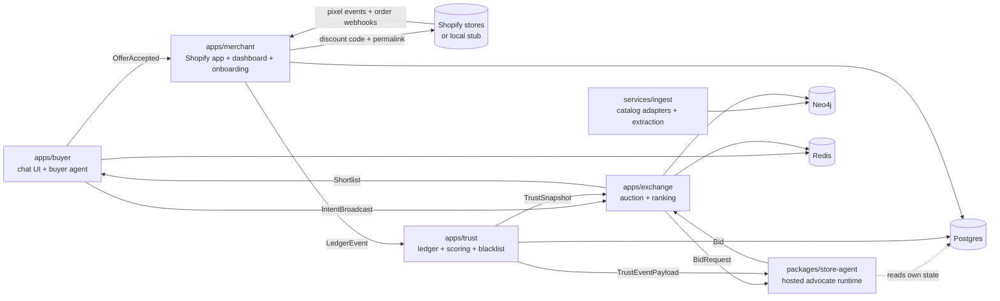

# ProxyShop — Design

## Architecture

Monorepo, separate deployables, all composed via docker-compose.

Component responsibilities:
- **apps/buyer** (TS/Next.js + Python agent svc): chat, clarification (≤3 questions), intent confirmation UI, shortlist rendering with provenance labels, magic-link auth, pseudonym issuance, redirect handoff.
- **apps/exchange** (Python/FastAPI): intent-cluster assignment, candidate retrieval (Neo4j vector + attributes), bid solicitation fan-out with timeout, deterministic ranking, shortlist slotting, bandit policy updates, loss-report aggregation. **Never touches envelopes** (C3).
- **packages/store-agent** (Python lib + runner): per-store advocate. Loads store context (catalog summary, envelope, learned policy, priors), answers BidRequests through provenance tool hooks only. Also the open-source/Tier-2 artifact; external bids enter through the same Bid schema + signature.
- **apps/merchant** (TS React Router v7 Shopify app + Python onboarding svc): install flow, `webPixelCreate`, webhook receivers, discount-code mutations + validity check, onboarding interview → envelope versions, shadow mode, dashboard, kill switch.
- **apps/trust** (Python): append-only ledger writer, reconciliation (pixel vs webhook), Beta-Bernoulli scoring, decay, blacklist binding to business identity, exploration-slice bookkeeping, TrustEventPayload push, feedback prompts.
- **services/ingest** (Python): `CatalogAdapter` implementations (`catalog_mcp`, `signed_fetch`), policy-page fetch, Haiku-class extraction on content-hash change, claim decomposition, entity resolution, Neo4j upserts with provenance nodes.
- **pixel/** (TS): web pixel extension; subscribes standard events; POST `fetch(..., {keepalive:true})` to merchant app collector with clientId, checkout token, order id, discountApplications.
- **services/shopify-stub** (Python): local implementation of every Shopify surface used (Admin GraphQL subset, webhook delivery, permalink+code redemption, pixel event emission). Fixture backbone (C9).
- **services/sim** (Python): seeded buyer-traffic simulator driving intents, acceptances, purchases, returns, and the dishonest-store script from the fixture manifest.
- **apps/seller-reference** (Python): unharnessed seller personas (value / specialist / aggressive) submitting free-text pitches with asserted claims through the external `POST /bid` door. They exist to exercise extraction+verification adversarially; they may tailor pitches but never redefine catalog facts.
- **packages/verification** (Python): claim extractor (atomic typed claims with source spans; LLM behind strict schemas) + deterministic comparators (normalized boolean/string equality, numeric with per-field tolerance, price vs offer and fresh catalog, set containment, relationship existence) producing verified|contradicted|unsupported|ambiguous with evidence refs; idempotent per (pitch, verifier version, catalog snapshot).

Merged repo layout (partner-reconciled names): `packages/{contracts,store-agent,verification,ranking,llm,observability}`, `apps/{buyer,exchange,trust,merchant,seller-reference}`, `services/{ingest,shopify-stub,sim}`, `pixel/`, `db/migrations`, `graph/`, `fixtures/`, `evals/`, `e2e/`. `packages/contracts` is the schema home (formerly "protocol"). Repo name: `proxyshop`.

## Interfaces (contracts between tickets)

All cross-service schemas live in `packages/protocol` (JSON Schema source → generated Pydantic + TS types). Schema changes land only in E1-scoped tickets; all other tickets treat `packages/protocol` as read-only.

### Core protocol objects (JSON Schema names)
- `Intent` (partner schema adopted, extended) — `{intent_id, cluster_id, query, category, hard_constraints: [{field, op: enum[eq|lte|gte|in|contains], value, unit?}], preferences: [{field, direction: enum[maximize|minimize|prefer], weight}], ship_to, currency, budget_band, created_at, schema_version}`. Hard constraints are filters (R19).
- `BuyerProfile` — `{pseudonym, buckets: {budget_band, category_affinity[], frequency_tier, region, first_time: bool}}` — no identity fields; pseudonym rotates per session.
- `BidRequest` — `{auction_id, intent: Intent, profile: BuyerProfile, respond_by: ts}`
- `Claim` — `{key, value, provenance: Provenance}`
- `Provenance` — `{source: enum[scraped|pixel_feed|owner_statement|envelope_rule|learned_policy|network|seller_asserted], ref: str, observed_at: ts, authority_rank: int}`
- `Offer` — `{product_ref, unit_price, discount: {type, value, provenance}, commitments: [Claim], total_price}`
- `Bid` — `{auction_id, store_id, offer: Offer, claims: [Claim], message?: str, agent_version, signature, schema_version}`. Dual-path boundary (R8): hosted-agent bids must carry hook-provenanced claims (violation → reject); external bids may carry `message` free text and claims with provenance source `seller_asserted` → routed to `packages/verification`. Expired/blacklisted/schema-invalid bids reject on every path.
- `VerificationResult` — `{pitch_ref, catalog_snapshot, claims: [{claim_ref, status: enum[verified|contradicted|unsupported|ambiguous], observed_value?, evidence_refs, confidence}], verified_claim_ratio, verifier_version}`
- `Shortlist` — `{auction_id, slots: [{slot: enum[fit|value|reliability|specialist], bid_ref, fit_score, trust_summary, provenance_labels}]}`
- `LossReport` (aggregated, delayed) — `{store_id, window, by_cluster: [{cluster_id, lost: int, reasons: {fit: int, price: int, commitments: int, trust: int}, unmet_criteria: [str]}]}` — no amounts, no rival identities.
- `LedgerEvent` — `{event_id, ts, kind: enum[bid_placed|shown|accepted|code_created|checkout_redirect|checkout_pixel|order_paid|order_fulfilled|refund|feedback|reconciled|claim_verified|policy_event], auction_id?, store_id?, order_ref?, payload}` — append-only, hash-chained (`prev_hash`).
- `TrustSnapshot` — `{store_id, score: float, dims: {price_honored, discount_honored, shipped_on_time, not_returned, feedback_match}: {alpha, beta, decayed_at}, blacklisted: bool}`
- `TrustEventPayload` — `{store_id, event: LedgerEvent, dim, delta, pseudonymous_context}` (R13)
- `Envelope` (never crosses into exchange) — `{store_id, version, floors: [{product_ref?, min_price}], max_discount_pct, budget_cap, pursue_clusters: [..], standing_commitments: [Claim(provenance=owner_statement)], activation: enum[shadow|active|killed]}`

### Service APIs (pinned routes)
- exchange: `POST /auctions` (Intent+profile→auction_id), `GET /auctions/{id}/shortlist`, `POST /auctions/{id}/accept {bid_ref}` → `{permalink_url}` (delegates code creation to merchant app), `POST /internal/outcomes` (from trust; bandit update).
- store-agent runner: `POST /bid` (BidRequest→Bid|decline) — same route for hosted and external Tier-2 agents; external requests carry a registered signature.
- merchant: `POST /codes {store_id, offer}` → `{code, permalink_url}` (creates `discountCodeBasicCreate` usageLimit:1, expiry ≤48h, validates combinesWith); `POST /webhooks/shopify/*`; `POST /pixel/collect`; `GET/PUT /stores/{id}/envelope`; `POST /stores/{id}/kill`.
- trust: `POST /events` (LedgerEvent), `GET /stores/{id}/trust`, `GET /snapshot` (all stores, exchange consumption), `POST /feedback/{order_ref}`.
- ingest: CLI + `POST /refresh/{store_id}`.

### Tool hooks (store-agent internal contract)
`get_product_fact(product_ref, key) -> Claim`, `get_live_state(product_ref) -> [Claim]` (pixel_feed), `get_owner_commitments(cluster_id) -> [Claim]`, `authorize_discount(product_ref, requested_pct) -> Claim|Denied` (envelope_rule; checks walls), `choose_policy_action(context) -> action` (learned_policy, logs policy version), `get_network_prior(cluster_id) -> prior`. The LLM cannot emit Offer/Claim fields except through these.

## Data models

**Neo4j** (partner attribute-node model adopted + retrieval layer): nodes `Store{store_id, domain, business_identity, tier}`, `Product{product_id, canonical_name, brand, status, embedding}`, `Variant{variant_id, seller_sku, name, status}`, `Offer{offer_id, price, currency, availability, observed_at}`, `Category`, `AttributeValue{key, value_string, value_number, value_bool, unit}`, `Ingredient`, `PolicyPage{kind, hash, snapshot_ref}`, `Source{source_id, url, content_hash, observed_at, extractor_version, confidence, source_class}` (Source ≡ our Provenance; `source_class` carries the provenance enum), `IntentCluster`. Edges: `SELLS`, `MAKES_OFFER→FOR`, `HAS_VARIANT`, `IN_CATEGORY`, `HAS_ATTRIBUTE`, `CONTAINS`, `COMPATIBLE_WITH`, `SAME_AS{confidence}`, `STATES`, and `SUPPORTED_BY→Source` from every material fact. Uniqueness constraints on every stable ID; never match products by free-text name alone. Vector index `product_embedding` (1024, cosine). Identity nodes never exist here.

**Postgres** schemas (separate roles; partner table set adopted inside them): `ledger.*` — append-only, hash-chained: `commerce_events(idempotency_key UNIQUE, prev_hash, …)`, `claims`, `claim_verifications`, `verification_evidence_refs`, `trust_observations`, `trust_scores(score, confidence, score_version)`, `policy_events`, `ranking_runs`, `ranking_candidates(eligible, components JSONB, exclusion_reasons)`, `catalog_snapshots`, `crawl_jobs`, `crawl_pages` (`exchange` role: no write; `trust_rw`); `sealed.*` — envelopes (versioned), learned_policy, interview_transcripts, shadow_bids (**no grant for exchange role** — S7); `vault.*` — buyer email↔pseudonym history (buyer role only); `app.*` — sellers, seller_endpoints, seller_blacklist(reason_code, source, starts_at, expires_at, status, reviewed_by), intents, pitch_requests(deadline_at), pitches, offers(checkout_url, expires_at), buyer accounts. Verification rows record catalog snapshot + verifier version at decision time.

**Redis**: `auction:{id}` (state machine, TTL 15m), `session:{pseudonym}`, `bidlock:{code}`.

## Decisions & rationale (do not "improve" away)
- Reconciliation (approved): trust = one observation framework — verification outcomes first (signal at zero transactions), transaction calibration layered on the same per-dimension Beta structure with observation-type weights (contradicted 2.0, severe policy 3.0, mismatch returns 1.5; verified + fulfilled positive); neutral prior ~Beta(2,2) with explicit low confidence. Rejected: two separate trust systems.
- Dual-path claims: harness guarantees hosted-agent claims; extraction+verification disciplines external ones. Rejected: blanket rejection of unprovenanced claims (would make verification vacuous and block Tier-2/personas).
- Starting-slice checkout is redirect/simulated with `checkout_redirect` + downstream events identical to the Shopify path (C11); checkout URLs validate against the registered seller domain. Rejected: divergent event schemas per checkout mode.
- Rank formula (single, published, jointly weighted): eligibility filters first (blacklist fail-closed, expiry, valid checkout domain, hard constraints per R19), then `rank_score = w_m*intent_match + w_e*verified_claim_ratio + w_t*trust + w_v*price_value + w_d*delivery_fit − policy_penalties`, features normalized to [0,1], stable tie-break (verified hard-fit count → trust → price → bid id), component map + human-readable explanation returned. Evidence freshness lives in verification confidence, not the formula. Bandit adjusts exposure/exploration only.
- First-price sealed auction; losers receive only aggregated delayed LossReports. Second-price leaks the runner-up's price; real-time per-auction feedback invites tit-for-tat dynamics.
- Ranking = published formula `rank_score = w_f*fit + w_v*offer_value + w_t*trust` with fixed public weights per environment; fit comes from retrieval+rerank but the combination is deterministic and fee/tier-blind (R11). Bandit adjusts exploration/exposure, not the formula weights.
- Store-loop learning: Thompson sampling over discount-depth buckets × commitment sets per cluster, initialized from network priors computed from pitch/value-prop outcomes only. Discount elasticity is never pooled across stores.
- Cold start: with no learned policy, the deterministic default bid = list price, envelope standing commitments, intro discount rule if the envelope defines one. No LLM improvisation of price.
- Trust math: per-dimension Beta(α,β) with exponential decay toward the prior; score = weighted product of dimension means; blacklist at published threshold; new-store prior α/β chosen so ~N clean episodes are needed to reach mid trust (fixture manifest defines N).
- Pixel is lossy (documented non-firing cases); `orders/paid` webhook is authoritative; reconciliation emits a `reconciled` event and discrepancies count toward `price_honored`/`discount_honored` only from webhook data.
- Embeddings: `EmbeddingProvider` interface; default local bge-m3-class (1024d); tests use `HashEmbedding` deterministic double; swapping providers = re-embed + rebuild index script (shipped).
- LLM: per-role model IDs from env (`BUYER_MODEL`, `STORE_AGENT_MODEL` default sonnet-class; `INTERVIEW_MODEL` opus-class; `EXTRACT_MODEL` haiku-class); store-agent prompts structured static-context-first for prompt caching; tests use recorded/deterministic doubles.
- Dev-store reality (A1): fixtures ingest via `signed_fetch` with storefront password; `catalog_mcp` adapter ships contract-tested against recorded mocks.
- Non-Shopify future and Tier-2 are seams, not features: `CatalogAdapter` interface and signed external `POST /bid` exist; nothing else.

## Verification strategy
- `make verify` at repo root = ruff + mypy + eslint + tsc + pytest + vitest against stub services and doubles; offline (C9). Every ticket's verify maps onto a scoped subset; T-0 makes the empty pipeline green.
- Layers: unit (protocol validation, trust math, envelope walls), integration (service pairs over docker-compose with shopify-stub), e2e (S1 scripted flow via sim), property tests (ledger replay S3; provenance rejection S5), grant/import-lint tests (S7).
- `make e2e-live` = demo procedure against seeded dev stores; never a ticket gate.
- Contract layer: every cross-domain endpoint ships a checked-in OpenAPI example + consumer contract test; schema changes require both owners' review.
- Eval gates (from partner plan, run as deterministic fixtures; live-LLM evals separate): golden intents/pitches covering contradictions, stale/absent evidence, wrong variant/units, injection in pages and pitches, claim-splitting and verbosity gaming, timeouts, duplicate pitches, expired offers, blacklist expiry. Release blockers per S8.
- `make demo-seed SEED_CATEGORY=<name>` provisions catalogs + fixture manifest into stub or live stores.
