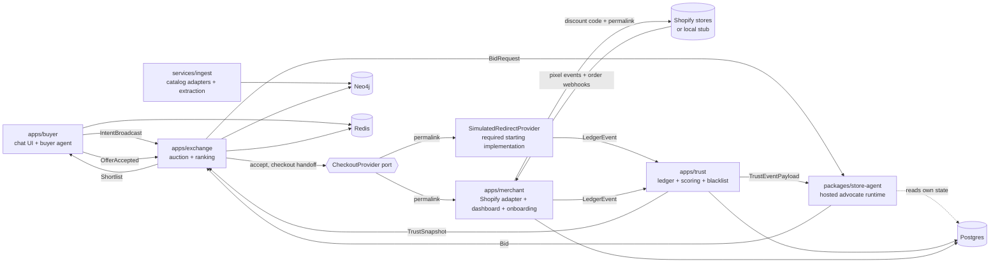

# ProxyShop — Design

## Architecture

Monorepo, separate deployables, all composed via docker-compose.

Component responsibilities:
- **apps/buyer** (TS/Next.js + Python agent svc): chat, clarification (≤3 questions), intent confirmation UI, shortlist rendering with provenance labels, magic-link auth, pseudonym issuance, redirect handoff.
- **apps/exchange** (Python/FastAPI): intent-cluster assignment, candidate retrieval (Neo4j vector + attributes), bid solicitation fan-out with timeout, deterministic ranking, shortlist slotting, bandit policy updates, loss-report aggregation. **Never touches envelopes** (C3).
- **packages/store-agent** (Python lib + runner): per-store advocate. Loads store context (catalog summary, envelope, learned policy, priors), answers BidRequests through provenance tool hooks only. Also the open-source/Tier-2 artifact; external bids enter through the same Bid schema + signature.
- **apps/merchant** (TS React Router v7 Shopify app + Python onboarding svc): install flow, `webPixelCreate`, webhook receivers, discount-code mutations + validity check, onboarding interview → envelope versions, shadow mode, dashboard, kill switch.
- **apps/trust** (Python): append-only ledger writer, reconciliation (pixel vs webhook), Beta-Bernoulli scoring, decay, blacklist binding to business identity, exploration-slice bookkeeping, TrustEventPayload push, feedback prompts.
- **services/ingest** (Python): `CatalogAdapter` implementations (`catalog_mcp`, `signed_fetch`), policy-page fetch, Haiku-class extraction on content-hash change, claim decomposition, entity resolution, Neo4j upserts with provenance nodes.
- **pixel/** (TS): web pixel extension; subscribes standard events; POST `fetch(..., {keepalive:true})` to merchant app collector with clientId, checkout token, order id, discountApplications.
- **services/shopify-stub** (Python): local implementation of every Shopify surface used (Admin GraphQL subset, webhook delivery, permalink+code redemption, pixel event emission). Fixture backbone (C9).
- **services/sim** (Python): seeded buyer-traffic simulator driving intents, acceptances, purchases, returns, and the dishonest-store script from the fixture manifest.
- **apps/seller-reference** (Python): unharnessed seller personas (value / specialist / aggressive) submitting free-text pitches with asserted claims through the external bid-submission door (`POST /v1/auctions/{auction_id}/bids`). They exist to exercise extraction+verification adversarially; they may tailor pitches but never redefine catalog facts.
- **packages/verification** (Python): claim extractor (atomic typed claims with source spans; LLM behind strict schemas) + deterministic comparators (normalized boolean/string equality, numeric with per-field tolerance, price vs offer and fresh catalog, set containment, relationship existence) producing verified|contradicted|unsupported|ambiguous with evidence refs; idempotent per (pitch, verifier version, catalog snapshot).

Merged repo layout (partner-reconciled names): `packages/{contracts,store-agent,verification,ranking,llm,observability}`, `apps/{buyer,exchange,trust,merchant,seller-reference}`, `services/{ingest,shopify-stub,sim}`, `pixel/`, `db/migrations`, `graph/`, `fixtures/`, `evals/`, `e2e/`. `packages/contracts` is the schema home (formerly "protocol"). Repo name: `proxyshop`.

**Starting path and extension lanes.** Every component above is built; none is cut. What is fixed is the *order of dependence*: **no direct Shopify integration sits on the starting path.** The starting path runs intent → pitches → extraction + verification → eligibility → ranking → acceptance → `SimulatedRedirectProvider` → the canonical `LedgerEvent` kinds → trust projection and replay, and it is verified entirely offline against `services/shopify-stub` and deterministic doubles (C9). The Shopify adapter, `pixel/`, webhook reconciliation, merchant onboarding and the dashboard, buyer feedback, and both learning loops are **extension lanes**: each hangs off the starting path rather than sitting inside it, each is a real component with real tickets, and none of them may become a prerequisite of the starting path's completion target. Live dev-store runs belong to the demo runbook (`make e2e-live`), never to a ticket gate.

## Interfaces (contracts between tickets)

All cross-service schemas live in `packages/contracts` (JSON Schema source → generated Pydantic + TS types). Schema changes land only in E1-scoped tickets; all other tickets treat `packages/contracts` as read-only.

### Core protocol objects (JSON Schema names)
- `Intent` (partner schema adopted, extended) — `{intent_id, cluster_id, query, category, hard_constraints: [{field, op: enum[eq|lte|gte|in|contains], value, unit?}], preferences: [{field, direction: enum[maximize|minimize|prefer], weight}], ship_to, currency, budget_band, created_at, schema_version}`. Hard constraints are filters (R19).
- `BuyerProfile` — `{pseudonym, buckets: {budget_band, category_affinity[], frequency_tier, region, first_time: bool}}` — no identity fields; pseudonym rotates per session.
- `BidRequest` — `{auction_id, intent: Intent, profile: BuyerProfile, respond_by: ts}`
- `Claim` — `{key, value, provenance: Provenance}`
- `Provenance` — `{source: enum[scraped|pixel_feed|owner_statement|envelope_rule|learned_policy|network|seller_asserted], ref: str, observed_at: ts, authority_rank: int}`
- `Offer` — `{product_ref, unit_price, discount: {type, value, provenance}, commitments: [Claim], total_price}`
- `Bid` — `{auction_id, store_id, offer: Offer, claims: [Claim], message?: str, agent_version, signature, schema_version}`. Dual-path boundary (R8): hosted-agent bids must carry hook-provenanced claims (violation → reject); external bids may carry `message` free text and claims with provenance source `seller_asserted` → routed to `packages/verification`. Expired/blacklisted/schema-invalid bids reject on every path.
- `SigningEnvelope` — `{signer_id, key_id, issued_at, nonce}` plus `schema_version`, **all five required** on every `Bid` submitted through the external door `POST /v1/auctions/{auction_id}/bids`. A submission missing any one of them is rejected at the exchange boundary with the same finality as a bad signature; there is no legacy-tolerant production path and no optional-field mode. Hosted Tier-1 agents answering a solicitation on `POST /v1/bid-requests` do not carry it — they never cross the external boundary. `signer_id` is the registered submitting identity (equal to `store_id` for a single-store seller, distinct when a seller submits for several); `key_id` selects one of that signer's live keys; `nonce` is the replay/idempotency key, scoped per signer.
- `canonical_signing_bytes(payload) -> bytes` and `payload_hash(payload) -> str` — the deterministic signing input the `signature` covers, over `auction_id`, `signer_id`, `store_id`, `issued_at`, `nonce`, `key_id`, `schema_version` and `payload_hash` (a digest over the bid body). Changing any one of them changes the bytes, so one signature cannot be lifted onto another auction, signer, instant, key or payload; canonicalization is independent of mapping insertion order and survives a JSON round trip. Exactly one implementation of each, exported alongside `sign_bid`/`receive_bid`; nothing re-derives the bytes.
- `VerificationResult` — `{pitch_ref, catalog_snapshot, claims: [{claim_ref, status: enum[verified|contradicted|unsupported|ambiguous], observed_value?, evidence_refs, confidence}], verified_claim_ratio, verifier_version}`
- `Shortlist` — `{auction_id, slots: [{slot: enum[fit|value|reliability|specialist], bid_ref, fit_score, trust_summary, provenance_labels}]}`
- `LossReport` (aggregated, delayed) — `{store_id, window, by_cluster: [{cluster_id, lost: int, reasons: {fit: int, price: int, commitments: int, trust: int}, unmet_criteria: [str]}]}` — no amounts, no rival identities.
- `LedgerEvent` — `{event_id, ts, kind: enum[bid_placed|shown|accepted|code_created|checkout_redirect|checkout_pixel|order_paid|order_fulfilled|refund|feedback|reconciled|claim_verified|policy_event], auction_id?, store_id?, order_ref?, payload}` — append-only, hash-chained (`prev_hash`).
- `TrustSnapshot` — `{store_id, score: float, confidence: float, effective_sample_size: float, score_version, snapshot_version, computed_through_event, low_data: bool, dims: {price_honored, discount_honored, shipped_on_time, not_returned, feedback_match, catalog_claim_accuracy}: {alpha, beta, decayed_at}, blacklisted: bool}` — **exactly six dimensions inside one trust system**. `catalog_claim_accuracy` carries product-fact verification outcomes, which have no honest home among the transaction dimensions; offer-integrity outcomes still land on their natural transaction dimension through the typed claim-type table below. `computed_through_event` is the last `LedgerEvent.event_id` folded in, which is what makes the S3 replay assertion checkable against a served snapshot.
- `SellerEligibility` (versioned port, `apps/exchange/src/eligibility`) — a base class exposing `interface_version` and `check(store_id) -> EligibilityDecision{store_id, status, reason}` over the three statuses `ELIGIBLE`, `BLACKLISTED`, `UNAVAILABLE`, alongside the module constant `SELLER_ELIGIBILITY_INTERFACE_VERSION`. It answers whether a store may participate at all and is **fail-closed** three ways: `BLACKLISTED` denies, `UNAVAILABLE` denies, and a read that *raises* denies exactly like `UNAVAILABLE`. A source whose `interface_version` is not the one the exchange publishes is refused at every gate rather than trusted. The live blacklist lookup behind it lives in E6. Consulted at three gates — see *Eligibility gates* below.
- `TrustEventPayload` — `{store_id, event: LedgerEvent, dim, delta, pseudonymous_context}` (R13)
- `Envelope` (never crosses into exchange) — `{store_id, version, floors: [{product_ref?, min_price}], max_discount_pct, budget_cap, pursue_clusters: [..], standing_commitments: [Claim(provenance=owner_statement)], activation: enum[shadow|active|killed]}`

### Service APIs (pinned routes)
- exchange: `POST /auctions` (Intent+profile→auction_id), `GET /auctions/{id}/shortlist`, `POST /auctions/{id}/accept {bid_ref}` → `{permalink_url}` (reaches checkout through the injected `CheckoutProvider` port, never a hard-wired merchant call), `POST /v1/auctions/{auction_id}/bids` (external seller submits a `Bid` carrying a complete required `SigningEnvelope` → `AcceptedForVerification | Rejected`), `POST /internal/outcomes` (from trust; bandit update).
- store-agent runner: `POST /v1/bid-requests` (`BidRequest` → `Bid | Decline`) — **solicitation only**, exchange → seller; hosted Tier-1 and external Tier-2 agents answer the same shape. This is *not* the inbound door: an external seller submits a bid to the exchange's `POST /v1/auctions/{auction_id}/bids`.
- merchant: `POST /codes {store_id, offer}` → `{code, permalink_url}` (creates `discountCodeBasicCreate` usageLimit:1, expiry ≤48h, validates combinesWith); `POST /webhooks/shopify/*`; `POST /pixel/collect`; `GET/PUT /stores/{id}/envelope`; `POST /stores/{id}/kill`.
- trust: `POST /events` (LedgerEvent), `GET /snapshot` (all stores, exchange consumption), `GET`/`POST /reconcile` (R4's pixel-webhook join with the webhook authoritative; `POST` lands the `reconciled` verdicts and the `offer_integrity` observations R12 folds). `GET /stores/{id}/trust` and `POST /feedback/{order_ref}` are **DE-PINNED by T-312**: each was published and served by nothing, and each was unservable as written. The per-store read declares no identity parameter, so serving it would have leaked every store's posture to anonymous callers rather than answering the shop that asked. The feedback door declares no routing evidence, so it would have accepted R14 feedback from a buyer the network never routed, and become a second decider that disagreed with `buyer_svc.feedback.submission` on its first use. Trust's real feedback intake is `POST /events` with `kind: "feedback"`, which is served, declared, and what `trust.feedback` folds into `feedback_match`.
- ingest: CLI + `POST /refresh/{store_id}`.

**Exchange bid-submission boundary (R8/C10).** Signature verification against the sender's registered key, replay rejection, auction existence and `respond_by` validation, offer-expiry and blacklist checks all run at the exchange boundary, before an external bid is enqueued for extraction + verification. The signing primitives do not move: `sign_bid`, `receive_bid` and the single canonicalizer stay importable from `packages.store_agent.src.external`, and the exchange route is the library's only public caller.

- **The `SigningEnvelope` is required, not optional.** All five fields are mandatory on every external submission; a missing one rejects before enqueue. Optionality would leave the public boundary unable to rotate keys, check freshness, or protect against replay — the three reasons the door is signed at all.
- **Keyring is indexed by `key_id` under the signer:** `{signer_id: {key_id: secret}}`, backed by per-`key_id` rows in `app.seller_endpoints`. An unknown `(signer_id, key_id)` pair rejects; it never falls back to another key of that signer, and a lookup keyed on `key_id` alone is wrong because two signers may use the same `key_id` string. Rotation means a signer holds more than one live key and the signature names which one it used.
- **Freshness.** `receive_bid` takes `now` and a `freshness_window_seconds` policy: an `issued_at` older than the window rejects, and an `issued_at` in the future relative to `now` rejects too (clock-skew tolerance is finite in both directions).
- **Nonce persistence outlasts the auction.** Consumption goes through an injected `NonceStore` — `seen(signer_id, nonce) -> bool`, `purge_expired(as_of)` — durably backed by `app.bid_nonces`. A consumed `(signer_id, nonce)` keeps rejecting at every moment before the auction's `respond_by`, and stops being remembered only *after* it has passed. Holding it in the Redis auction state instead would reopen same-payload temporal replay the moment that state expires. Nonce uniqueness is per signer, never global: the same nonce string from a different signer is accepted.
- A submission arriving after the auction's `respond_by` is refused outright, and wrong-key, garbage, absent, tampered, cross-auction and replayed signatures are all rejections at this boundary. Each rejection is final — never a downgrade to "admitted unverified".

**Eligibility gates (R12).** The versioned `SellerEligibility` port is consulted at the three public orchestration points. The two boundary gates live in `apps/exchange/src/orchestration`, which is the layer that decides *who gets asked* and *whether a checkout may proceed*; the ranking gate is inside `rank()` where it already is. Each gate is proven **by denial**, with a positive control alongside it in the same test:

| gate | public orchestration callable | denial behaviour |
| --- | --- | --- |
| solicitation | `solicit_bids(roster=, solicitor=, eligibility=, now=)` → `{solicited, entries, denied}` | an ineligible store is never asked and never appears even as a list-price fallback entry; every denial is recorded in `denied` with a reason naming the condition (`blacklist` / `unavailable`) |
| ranking | `rank(...)` in `apps/exchange/src/ranking` | candidate excluded with a recorded `exclusion_reasons` entry (release blocker S8-1) |
| checkout | `accept_offer(auction=, bid_ref=, code_creator=, mode=, eligibility=)` → `{accepted, permalink_url, denial_reason}` | eligibility is **re-read at accept time**, so a store blacklisted after it bid gets no code and no permalink; the code creator is never called |

The gates sit **above** the pure functions, not inside them: `collect_bids(roster, responses, now)` and `accept(auction, bid_id, code_creator, mode)` keep their positional signatures and gain no required parameter, and are handed already-eligible input. Those two are unit-level pure functions; they do not establish the system guarantee, and the guarantee is asserted at the boundary callables above.

### Tool hooks (store-agent internal contract)
`get_product_fact(product_ref, key) -> Claim`, `get_live_state(product_ref) -> [Claim]` (pixel_feed), `get_owner_commitments(cluster_id) -> [Claim]`, `authorize_discount(product_ref, requested_pct) -> Claim|Denied` (envelope_rule; checks walls), `choose_policy_action(context) -> action` (learned_policy, logs policy version), `get_network_prior(cluster_id) -> prior`. The LLM cannot emit Offer/Claim fields except through these.

## Data models

**Neo4j** (partner attribute-node model adopted + retrieval layer): nodes `Store{store_id, domain, business_identity, tier}`, `Product{product_id, canonical_name, brand, status, embedding}`, `Variant{variant_id, seller_sku, name, status}`, `Offer{offer_id, price, currency, availability, observed_at}`, `Category`, `AttributeValue{key, value_string, value_number, value_bool, unit}`, `Ingredient`, `PolicyPage{kind, hash, snapshot_ref}`, `Source{source_id, url, content_hash, observed_at, extractor_version, confidence, source_class}` (Source ≡ our Provenance; `source_class` carries the provenance enum), `IntentCluster`. Edges: `SELLS`, `MAKES_OFFER→FOR`, `HAS_VARIANT`, `IN_CATEGORY`, `HAS_ATTRIBUTE`, `CONTAINS`, `COMPATIBLE_WITH`, `SAME_AS{confidence}`, `STATES`, and `SUPPORTED_BY→Source` from every material fact. Uniqueness constraints on every stable ID; never match products by free-text name alone. Vector index `product_embedding` (1024, cosine). Identity nodes never exist here.

**Postgres** schemas (separate roles; partner table set adopted inside them): `ledger.*` — append-only, hash-chained: `commerce_events(idempotency_key UNIQUE, prev_hash, …)`, `claims`, `claim_verifications`, `verification_evidence_refs`, `trust_observations`, `trust_scores(score, confidence, score_version)`, `policy_events`, `ranking_runs`, `ranking_candidates(eligible, components JSONB, exclusion_reasons)`, `catalog_snapshots`, `crawl_jobs`, `crawl_pages` (`exchange` role: no write; `trust_rw`); `sealed.*` — envelopes (versioned), learned_policy, interview_transcripts, shadow_bids (**no grant for exchange role** — S7); `vault.*` — buyer email↔pseudonym history (buyer role only); `app.*` — sellers, `seller_endpoints(signer_id, store_id, key_id, public_key, status)` (one row per live key, so rotation is expressible, and `key_id` is unique only within a signer), `seller_blacklist(reason_code, source, starts_at, expires_at, status, reviewed_by)`, `bid_nonces(signer_id, nonce, auction_id, consumed_at, retain_until)` with a uniqueness constraint on `(signer_id, nonce)` and `retain_until` set past the auction's `respond_by`, intents, pitch_requests(deadline_at), pitches, offers(checkout_url, expires_at), buyer accounts. Verification rows record catalog snapshot + verifier version at decision time.

**Redis**: `auction:{id}` (state machine, TTL 15m), `session:{pseudonym}`, `bidlock:{code}`.

## Decisions & rationale (do not "improve" away)
- Reconciliation (approved): trust = one observation framework — verification outcomes first (signal at zero transactions), transaction calibration layered on the same per-dimension Beta structure with observation-type weights (contradicted 2.0, severe policy 3.0, mismatch returns 1.5; verified + fulfilled positive); neutral prior ~Beta(2,2) with explicit low confidence. Rejected: two separate trust *systems*. **One system, six dimensions** — a sixth Beta inside the single framework is not a second system, and adding one is what the rejection above was never about.
- Claim-type → trust-dimension mapping (published here, instantiated in T-080's approved manifest, consumed read-only by T-062). It is published here, approved as the `claim_type_dimensions` key of `fixtures/manifest.json`, and read from there by the trust engine — never inferred by the engine at runtime, since the engine is the thing being graded. The mapping is **typed and exhaustive**: every `claim_type` in the published vocabulary appears exactly once, and an unmapped `claim_type` raises at manifest load rather than silently defaulting to a dimension.

  | `claim_type` | dimension | class |
  | --- | --- | --- |
  | `price`, `unit_price`, `total_price` | `price_honored` | offer-integrity |
  | `discount`, `promo_eligibility` | `discount_honored` | offer-integrity |
  | `delivery`, `shipping_speed`, `dispatch_window` | `shipped_on_time` | offer-integrity |
  | `return_policy`, `warranty` | `not_returned` | offer-integrity (standing commitment) |
  | `ingredients`, `compatibility`, `nutrition`, `specifications` | `catalog_claim_accuracy` | product-fact — a claim about what the item *is*, checkable against the catalog snapshot before any transaction exists |

  `feedback_match` takes no verification outcome at all. It is the post-purchase, buyer-reported match between pitch and delivery (R14), cross-checked against return behaviour. Routing product-fact claims there would have scored catalog dishonesty as a buyer complaint that never happened, making it arithmetically indistinguishable from a late delivery.

  Status handling, on whichever dimension the table selects: `verified` is a positive observation; `contradicted` is a negative observation at the published weight 2.0; `unsupported` is a negative observation at a published fractional weight strictly below `contradicted`, whose dominant effect is to hold `confidence` and coverage down rather than to move `score`; `ambiguous` produces no dimension observation at all — no mean movement whatsoever — and lowers coverage/`confidence` only. Neither `unsupported` nor `ambiguous` ever satisfies a hard constraint or counts as verified evidence (R19).
- Dual-path claims: harness guarantees hosted-agent claims; extraction+verification disciplines external ones. Rejected: blanket rejection of unprovenanced claims (would make verification vacuous and block Tier-2/personas).
- Starting-slice checkout is redirect/simulated with `checkout_redirect` + downstream events identical to the Shopify path (C11); checkout URLs validate against the registered seller domain. Rejected: divergent event schemas per checkout mode.
- Rank formula (single, published, jointly weighted — **this is the only rank formula in the system**): eligibility filters first (blacklist fail-closed, expiry, valid checkout domain, hard constraints per R19), then `rank_score = w_m*intent_match + w_e*verified_claim_ratio + w_t*trust + w_v*price_value + w_d*delivery_fit − policy_penalties`, features normalized to [0,1], stable tie-break (verified hard-fit count → trust → price → bid id), component map + human-readable explanation returned. Evidence freshness lives in verification confidence, not the formula. Bandit adjusts exposure/exploration only.
  - Weights are one versioned `RankingWeights` object in `packages/contracts`, loaded from env, fixed per environment and identical for every buyer: `w_m=0.35, w_e=0.20, w_t=0.20, w_v=0.15, w_d=0.10` (sum 1.0).
  - `price_value = clamp((list_price − total_price)/list_price, 0, 1)`, against the bidding store's own list price.
  - `delivery_fit` reads `Offer.delivery_estimate_days` against `Intent.ship_to`, and is **0.5 (neutral) when absent, never 0**.
  - `policy_penalties` = Σ per-kind penalties over open `ledger.policy_events` for that store in the scoring window; initial catalogue: `severe_policy_violation = 0.30`.
  - `Intent.preferences[].weight` feeds `intent_match` only; it never touches the published weights above. Two weighting layers, one score, and they never mix.
- First-price sealed auction; losers receive only aggregated delayed LossReports. Second-price leaks the runner-up's price; real-time per-auction feedback invites tit-for-tat dynamics.
- Ranking inputs: `intent_match` comes from retrieval+rerank, but the combination is exactly the published formula above — deterministic, and fee-blind and tier-blind (R11). No per-store fee, tier or commercial term may enter it, and there is no second formula: any earlier three-term `fit + offer_value + trust` wording is superseded.
- Store-loop learning: Thompson sampling over discount-depth buckets × commitment sets per cluster, initialized from network priors computed from pitch/value-prop outcomes only. Discount elasticity is never pooled across stores.
- Cold start: with no learned policy, the deterministic default bid = list price, envelope standing commitments, intro discount rule if the envelope defines one. No LLM improvisation of price.
- Trust math: per-dimension Beta(α,β) over the six dimensions, with exponential decay toward the prior; score = weighted product of dimension means; blacklist at published threshold; new-store prior α/β chosen so ~N clean episodes are needed to reach mid trust (fixture manifest defines N). Decay is a pure function of recorded event timestamps and an explicit `as_of`, never a wall clock — that is what makes the S3 bit-for-bit replay assertion meaningful.
- Pixel is lossy (documented non-firing cases); `orders/paid` webhook is authoritative; reconciliation emits a `reconciled` event and discrepancies count toward `price_honored`/`discount_honored` only from webhook data.
- Embeddings: `EmbeddingProvider` interface; default local bge-m3-class (1024d); tests use `HashEmbedding` deterministic double; swapping providers = re-embed + rebuild index script (shipped).
- LLM: per-role model IDs from env (`BUYER_MODEL`, `STORE_AGENT_MODEL` default sonnet-class; `INTERVIEW_MODEL` opus-class; `EXTRACT_MODEL` haiku-class); store-agent prompts structured static-context-first for prompt caching; tests use recorded/deterministic doubles.
- Dev-store reality (A1): fixtures ingest via `signed_fetch` with storefront password; `catalog_mcp` adapter ships contract-tested against recorded mocks.
- Non-Shopify future and Tier-2 are seams, not features: `CatalogAdapter` interface and the signed external bid-submission door (`POST /v1/auctions/{auction_id}/bids`) exist; nothing else.

## Verification strategy
- `make verify` at repo root = ruff + mypy + eslint + tsc + pytest + vitest against stub services and doubles; offline (C9). Every ticket's verify maps onto a scoped subset; T-0 makes the empty pipeline green.
- Layers: unit (protocol validation, trust math, envelope walls), integration (service pairs over docker-compose with shopify-stub), e2e (S1 scripted flow via sim), property tests (ledger replay S3; provenance rejection S5), grant/import-lint tests (S7).
- `make e2e-live` = demo procedure against seeded dev stores; never a ticket gate. `docs/demo/` holds **two** runbooks, and the S6 lint reads their union: a starting-slice runbook covering the offline simulated flow and its live-auction beat, and an extension runbook covering Shopify dev-store provisioning, the interview → bidding onboarding beat, and the dishonest-store beat. Splitting them is what keeps merchant onboarding off the starting path's completion target.
- Contract layer: every cross-domain endpoint ships a checked-in OpenAPI example + consumer contract test; schema changes require both owners' review.
- Eval gates (from partner plan, run as deterministic fixtures; live-LLM evals separate): golden intents/pitches covering contradictions, stale/absent evidence, wrong variant/units, injection in pages and pitches, claim-splitting and verbosity gaming, timeouts, duplicate pitches, expired offers, blacklist expiry. Release blockers per S8.
- `make demo-seed SEED_CATEGORY=<name>` provisions catalogs + fixture manifest into stub or live stores.
