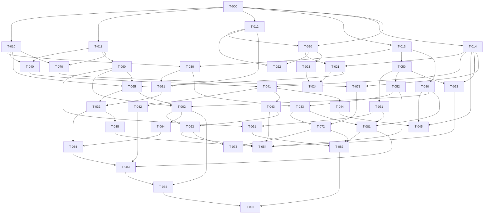

# ProxyShop — Task Graph

Full contracts live in `tickets.json` (the executable source of truth). This file is the human overview. Reconciled with partner (Sohail) docs; approved decisions recorded in SPEC §Reconciliation amendments.

## Epics

- **E1 Foundation** T-000, T-010..T-014 — repo, contracts (dual-path boundary), DBs (partner-reconciled schemas), Shopify stub, LLM client
- **E2 Ingestion** T-020..T-024 — SSRF-guarded adapters, extraction, entity resolution, refresh
- **E3 Exchange** T-030..T-035 — auctions, retrieval, filtered published ranking, accept/redirect, bandit, loss reports
- **E4 Store agent & sellers** T-040..T-045 — hooks, hosted runtime, learning, shadow/trust intake, external door, personas
- **E5 Merchant** T-050..T-054 — Shopify app, pixel, codes, onboarding, dashboard
- **E6 Trust & verification** T-060..T-065 — ledger, reconciliation, merged scoring, feedback/push, snapshot, verification engine
- **E7 Buyer** T-070..T-073 — auth/vault, intent, shortlist/accept, feedback
- **E8 Fixtures & e2e** T-080..T-085 — manifest+golden set, sim, S1/S2/S4/S8 proofs, demo runbook

## Dependency graph

## Tickets (one line each; contracts in tickets.json)

- **T-000** Monorepo skeleton with green empty verify pipeline  ·  deps: —
- **T-010** Contracts generate typed models and enforce the dual-path bid boundary  ·  deps: T-000
- **T-011** Postgres schemas enforce role isolation and hash-chained ledger ∥  ·  deps: T-000
- **T-012** Neo4j attribute-node catalog with vector retrieval through EmbeddingProvider ∥  ·  deps: T-000
- **T-013** Shopify stub reproduces the exact surface the system uses ∥  ·  deps: T-000
- **T-014** LLM client with per-role config, cache-first prompts, and test doubles ∥  ·  deps: T-000
- **T-020** Signed fetch adapter ingests a storefront including password-protected dev stores  ·  deps: T-000, T-012
- **T-021** Policy pages and marketing claims land in the graph with provenance  ·  deps: T-014, T-020
- **T-022** Same products across stores link via entity resolution ∥  ·  deps: T-012, T-020
- **T-023** Catalog MCP adapter passes recorded-contract tests ∥  ·  deps: T-020
- **T-024** Differential refresh keeps the graph current at field-appropriate cadence  ·  deps: T-021, T-023
- **T-030** Auctions fan out, time out, and always represent every store  ·  deps: T-010, T-013
- **T-031** Candidate retrieval and fit scoring feed the ranker ∥  ·  deps: T-012, T-030
- **T-032** Shortlists rank by the single published formula behind eligibility filters  ·  deps: T-031, T-065
- **T-033** Accepting an offer produces a validated code and permalink  ·  deps: T-030, T-052
- **T-034** Exchange bandit shifts exposure with outcomes and honors exploration  ·  deps: T-032, T-064
- **T-035** Loss reports aggregate reasons without leaking amounts ∥  ·  deps: T-032
- **T-040** Tool hooks are the only way facts and discounts enter a bid  ·  deps: T-010, T-011
- **T-041** Advocate runtime bids within walls and defaults deterministically cold  ·  deps: T-014, T-040
- **T-042** Store loop learns from its own outcomes only ∥  ·  deps: T-041
- **T-043** Shadow mode logs would-be bids and trust events adjust the agent ∥  ·  deps: T-041
- **T-044** External bids enter signed and route to verification, not rejection ∥  ·  deps: T-041
- **T-045** Three seller personas exercise the external door adversarially ∥  ·  deps: T-014, T-044, T-080
- **T-050** Installing the app wires pixel and webhooks against the stub  ·  deps: T-013
- **T-051** Pixel reports checkout outcomes the collector can join  ·  deps: T-050
- **T-052** Winning offers become single-use validated codes and permalinks  ·  deps: T-050
- **T-053** A plain-language interview yields an approved, versioned envelope ∥  ·  deps: T-014, T-050
- **T-054** The dashboard shows the walls and the window  ·  deps: T-035, T-043, T-052, T-053, T-063
- **T-060** Every event lands once, chained, and replays exactly  ·  deps: T-011
- **T-061** Webhook truth reconciles lossy pixel signals  ·  deps: T-051, T-060
- **T-062** Trust merges verification and outcome observations against the approved manifest  ·  deps: T-060, T-065, T-080
- **T-063** Trust events reach the store agent and buyers close the loop  ·  deps: T-043, T-062
- **T-064** Exchange consumes one snapshot shape for trust and exploration ∥  ·  deps: T-062
- **T-065** A golden pitch yields all four verification statuses with evidence  ·  deps: T-010, T-021, T-060
- **T-070** Buyers authenticate lightly and stores never see who they are  ·  deps: T-010, T-011
- **T-071** Three questions or fewer produce a confirmed structured intent  ·  deps: T-014, T-070
- **T-072** Shortlists render with provenance and accept hands off cleanly  ·  deps: T-033, T-071
- **T-073** Routed buyers can answer one structured feedback prompt ∥  ·  deps: T-063, T-072
- **T-080** The approved manifest and seed generator define ground truth ∥  ·  deps: T-013
- **T-081** Simulated buyers exercise the whole network from one seed  ·  deps: T-033, T-051, T-080
- **T-082** One scripted run proves the full S1 flow  ·  deps: T-061, T-072, T-081
- **T-083** Both learning loops demonstrably move under seeded outcomes  ·  deps: T-034, T-042, T-081
- **T-084** The dishonest store ends below threshold and off the shortlist  ·  deps: T-062, T-083
- **T-085** The demo is a runbook anyone on the team can execute ∥  ·  deps: T-082, T-084

∥ = parallel_safe (scope disjoint from every other open ticket).
